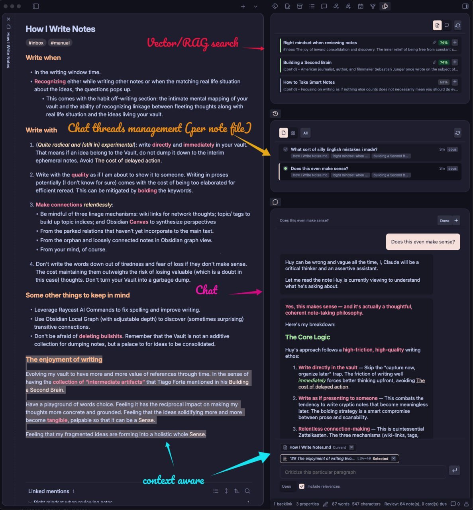
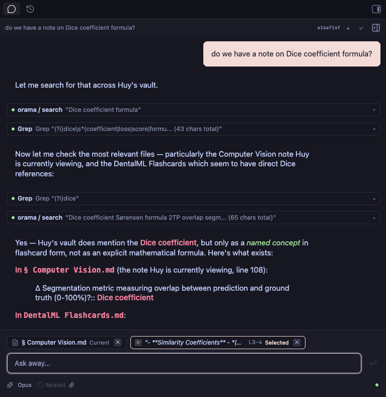
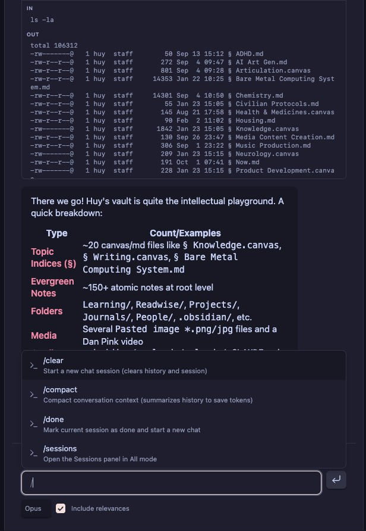
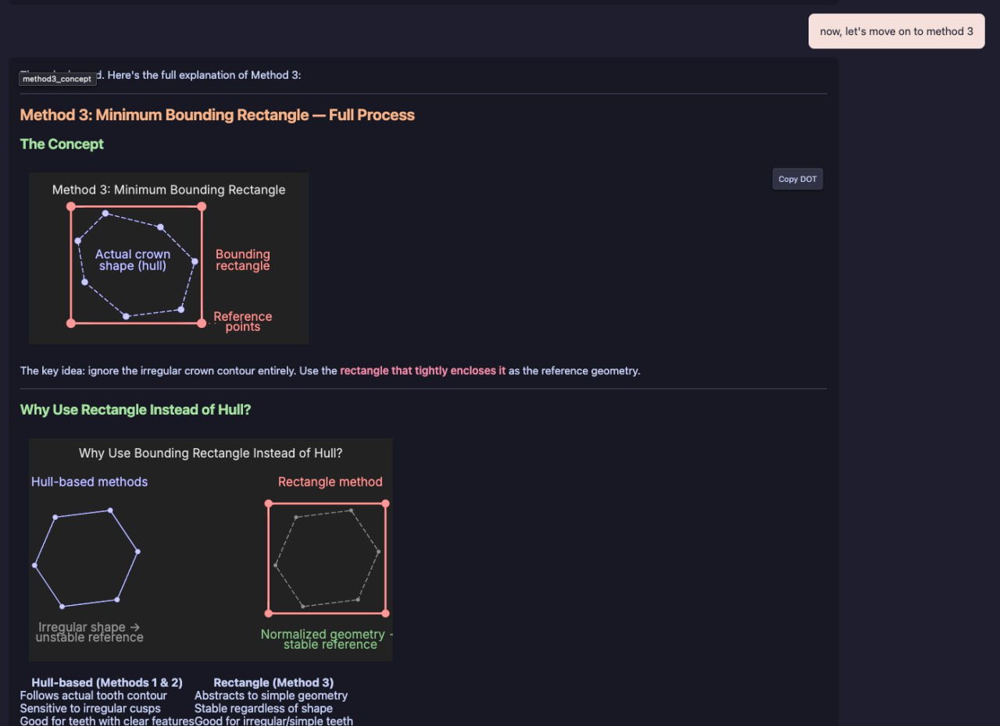

# Claude Agent for Obsidian

An Obsidian plugin that lets you chat with your vault using the Claude Agent SDK.

> **Heads up:** This plugin is a personal, in-progress project built around one specific setup — my vault, my Claude configuration, and my workflow. It's not (yet) a polished community release. I try to keep things generic, but assumptions leak in. Bugs are frequent, APIs change without notice, and some features may just not work for you. Use at your own risk, and frustration is expected. You've been warned — and welcomed anyway.



## Features

### Chat Interface



- Stream responses from Claude (Haiku, Sonnet, or Opus) with full markdown rendering
- Send messages mid-response — injected into the running SDK session for real-time steering
- `@mention` vault files to include them as context
- Attach images (paste, drag, or pick from vault)
- Editor selection context — selected text is automatically included with file/line info
- Active file awareness — Claude sees which note you're viewing
- Tool call visibility — expandable blocks showing MCP tool use and results
- Inline Graphviz diagram rendering with copy-DOT support



- Slash commands: `/new`, `/compact`, `/done`, `/rename`, `/sessions`



### Semantic Graph View
- Interactive force-directed graph combining wiki-link edges with embedding similarity edges
- Configurable link depth (1–3 hops), similarity thresholds, and physics settings
- Pin nodes to persist across center changes
- D3-force layout with zoom/pan

### Session Management
- Persistent sessions stored as JSONL transcripts (via Claude Code SDK)
- Session registry with title, status, model, associated files
- Browse sessions by active file ("This File") or vault-wide ("All Sessions")
- Context compaction — `/compact` summarizes history to save tokens, with collapsible boundary UI

## Requirements

- **Claude Code CLI** — installed and authenticated (`claude` on PATH)
- **OpenAI API Key** — for vault indexing (set in plugin settings)

## Installation

Clone and build somewhere **outside** your vault, then copy only the artifacts in:

```bash
# 1. Clone and build
git clone <this-repo>
cd claude-agent
pnpm install && pnpm build

# 2. Copy artifacts to your vault
PLUGIN_DIR="/path/to/your/vault/.obsidian/plugins/claude-agent"
mkdir -p "$PLUGIN_DIR"
cp dist/main.js dist/styles.css manifest.json "$PLUGIN_DIR/"
cp -r server "$PLUGIN_DIR/"

# 3. Install server dependencies (one-time)
cd "$PLUGIN_DIR/server" && npm install
```

Then reload Obsidian or toggle the plugin off/on. The server starts automatically when the plugin loads (local mode).

## Development

```bash
pnpm run deploy          # build + copy to vault (skips server/node_modules)
pnpm run deploy:deps     # includes server/node_modules (only when deps change)
```
